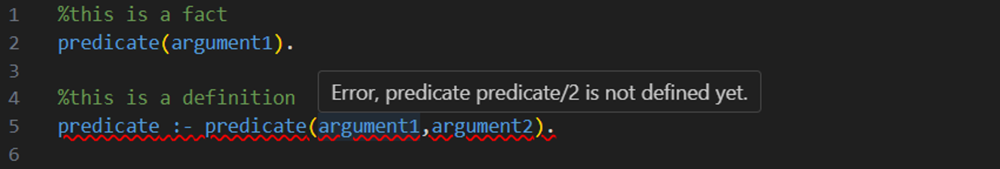
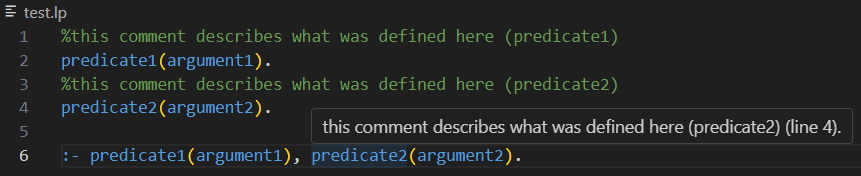
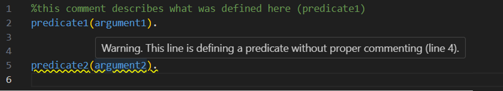
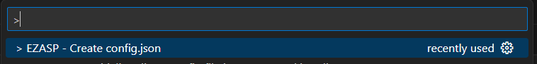
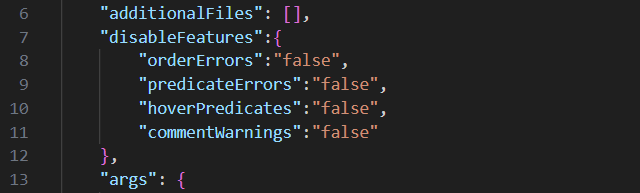

# EZASP - Making Learning Answer Set Programming Easier

This Visual Studio Code extension enhances your Answer Set Programming (ASP) development experience by introducing a range of features. Specifically designed to cater to newcomers in the ASP field, this extension provides functionalities that facilitate your ASP coding process, in hopes of helping to write efficient, error-free ASP code.

## Dependencies
This extension was built on top of two other extensions:

- [Answer Set Programming Language Support](https://marketplace.visualstudio.com/items?itemName=ffrankreiter.answer-set-programming-language-support) by Florian Frankreiter

- [asp-syntax-highlight](https://marketplace.visualstudio.com/items?itemName=abelcour.asp-syntax-highlight) by Arnaud Belcour

When you install this VS Code extension, it will also install the other two automatically. However, if any issues arise during installation, be aware that certain funcionalities may only be fully functional when the other two extensions are active.

## Features

### Warnings about Order of Rules Errors

Rules must appear in the following order: constants, facts, choices, definitions, constraints, and show statements. The extension checks this and highlights any out-of-order rules (red underline). Additionally, a hover message explains what the error is.

### Predicate Validation

The extension also highlights with a red underline if a predicate has not been defined in a previous line, and shows an hover message to explain which predicate has not been defined yet.

### On-Hover Predicate Information

When you hover over a predicate, the extension reveals a pop-up message containing the comment added by the user and where the predicate was defined.

### Missing Comment Warning

Rules without preceding comments are highlighted (yellow underline), and on hover a message will appear explaining this.

### Feature Disablement

If desired, you can disable any of first four features of this application. In the `config.json` file generated by running the command "> EZASP - create config.json", you will find a section called "disableFeatures". Whithin this section you can set the value of "true" or "false" for each of these features, with the default being "false". To disable any of these features, simply change the value to "true".

## Patch Notes

### 1.0.1

 - Added copyright licence.

 ### 1.0.2

 - Fixed bug where the absolute of an number ( symbolised by |X|) was being read as an invalid rule.

 ### 1.0.3

 - Adjusted ReadMe picture sizes.

 ### 1.0.4

 - Fixed bug where while writing a new rule, the error messages were being shown on the previous rule.