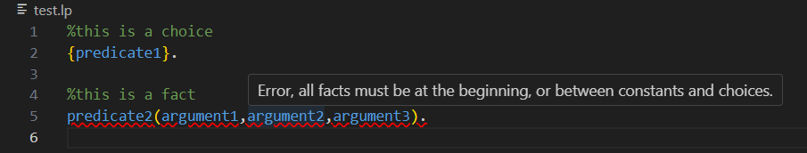

# EZASP - Making Learning Answer Set Programming Easier

## Dependencies
This extension was built on top of two other extensions:

- [Answer Set Programming Language Support](https://marketplace.visualstudio.com/items?itemName=ffrankreiter.answer-set-programming-language-support) by Florian Frankreiter

- [asp-syntax-highlight](https://marketplace.visualstudio.com/items?itemName=abelcour.asp-syntax-highlight) by Arnaud Belcour

When you install this VS Code extension, it will also install the other two automatically. However, if any issues arise during installation, be aware that certain funcionalities may only be fully functional when the other two extensions are active.

## Features

### Warnings about Order of Rules Errors

Rules must appear in the following order: constants, facts, choices, definitions, constraints, and show statements. The extension checks this and highlights any out-of-order rules (red underline). Additionally, a hover message explains what the error is.

### Predicate Validation

The extension also highlights with a red underline if a predicate has not been defined in a previous line, and shows an hover message to explain which predicate has not been defined yet.

### On-Hover Predicate Information

When you hover over a predicate, the extension reveals a pop-up message containing the comment added by the user and where the predicate was defined.

### Missing Comment Warning

Rules without preceding comments are highlighted (yellow underline), and on hover a message will appear explaining this.

### Multi-File Support

Building on the asp-language support extension, you can can use a config.json file to specify which of the previous features you want to be active. The assessment should focus solely on this and the corresponding command in the command pallete "EZASP - create config.json file” (and not on running clingo with several files).

### Feature Disablement

If desired, you can disable any of first four features of this application. In the config.json file generated by running the command "EZASP - create config.json file”, you will find a section called "disableFeatures". Whithin this section you can set the value of "true" or "false" for each of these features, with the default being "false". To disable any of these features, simply change the value to "true".