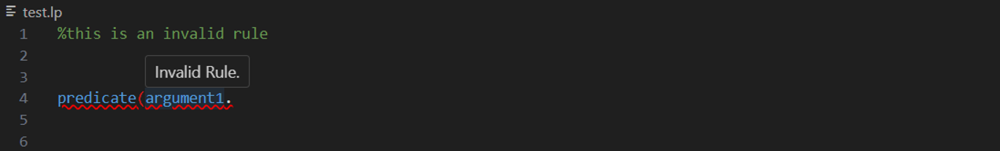
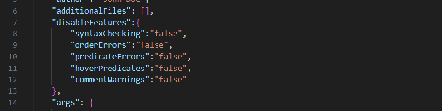

# EZASP - Making Learning Answer Set Programming Easier

This Visual Studio Code extension enhances your Answer Set Programming (ASP) development experience by introducing a range of features, based on the methodology introduced by Fandinno et al. (https://arxiv.org/abs/2111.06366), that aim to facilitate writing ASP programs in particular for newcomers.  

## Dependencies
This extension uses two other VS Code extensions: 

- [Answer Set Programming Language Support](https://marketplace.visualstudio.com/items?itemName=ffrankreiter.answer-set-programming-language-support) by Florian Frankreiter

- [asp-syntax-highlight](https://marketplace.visualstudio.com/items?itemName=abelcour.asp-syntax-highlight) by Arnaud Belcour

When installing this VS Code extension, it will also install these automatically. Note that this extension may only be fully functional when these two are installed and active. 

For details on these two extensions, we refer to their descriptions.

## Features

The following features of this VS Code extension (just like the features of the two extensions on which it builds) only work for files with the .lp extension. 

### Syntax Checking

When a rule contains any basic syntax issues within the scope of the rules admitted by the methodology employed, it triggers a red underline, accompanied by a hover message. 

### Warnings about Order of Rules Errors

Rules must appear in the following order: constants, facts, choices, definitions, constraints, and show statements. The extension checks this and highlights any out-of-order rules (red underline). Additionally, a hover message explains what the error is. 

### Predicate Validation

The extension also highlights with a red underline if a predicate has not been defined beforehand (in the same file or optionally in one of the other files of the same project – see below for details) and shows a hover message to explain which predicate has not been defined yet. 

### On-Hover Predicate Information

When you hover over a predicate, the extension reveals a pop-up message displaying the line where the predicate was defined, along with the preceding comment. 

### Missing Comment Warning

Rules without preceding comments are highlighted (yellow underline), and on hover a message will appear explaining this. 

### Feature Disablement

If desired, you can disable any of the previous features of this application. In the `config.json` file generated by running the command "> EZASP - create config.json", you will find a section called "disableFeatures". Within this section you can set the value of "true" or "false" for each of these features, with the default being "false". To disable any of these features, simply change the value to "true". In the same file, you can optionally include several file names with “” within [] in the field “additionalFiles” This also allows to run clingo with all these files simultaneously (see detailed description of Answer Set Programming Language Support). 

